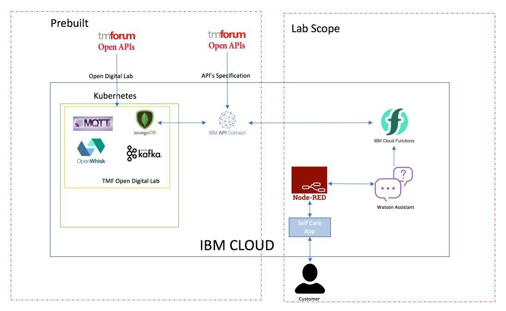

# Self Care App for TM Forum Lab

## Prerequisites
1. Create IBM Cloud ID (Mandatory) :  
check step by step instructions from 
[https://github.com/commgsc/TMF_ActionWeek_Clinic_Lab/blob/master/Pre-requisites/TMF_HandsOnLab-CreateAccount.pdf](https://github.com/commgsc/TMF_ActionWeek_Clinic_Lab/blob/master/Pre-requisites/TMF_HandsOnLab-CreateAccount.pdf) -  (save and remember your login id/pwd to be used during the lab)

2. Register and explore Open API's (Optional) : https://www.tmforum.org/open-apis/

3. Register and join the API Project (Optional) : https://www.tmforum.org/collaboration/api-project/  
    then Read on the Customer Management Suite. 
    We will be recreating Customer Selfcare with AI scenario as part of Open Digital Lab Clinic: https://projects.tmforum.org/wiki/pages/viewpage.action?spaceKey=AP&title=TMF910+SelfCare-CustomerManagement+ComponentSuite+Candidate+for+Team+Review&preview=/90523799/93978746/DataModelExamplesFor_TMF910_API_Suite_component_for_SelfCareApp_v1.0.docx
    
4. Open Digital Lab (Optional) : Read on what open digital lab is from : https://inform.tmforum.org/open-apis/2018/06/tm-forum-open-digital-lab-provides-sandbox-innovation/
 
## Overview
The Open Digital Lab provides a safe space for inter-company collaborative proof of concept generation leveraging open standards. With the pace of change in the industry continuing to accelerate, and partnerships with other companies to deliver new services and solutions increasing in importance, there has never been a greater need for an environment for collaborative co-creation of innovative new solutions and services. The TM Forum Open Digital lab hosted by IBM provides this environment where inter-company proof of concepts can be rapidly developed, tested and iterated.

The Open Digital Lab is a member benefit for the 900-member companies who are joined TM Forum. To access the lab, first sign up for a free IBM Cloud account and connect to the TM Forum space where a feast of tools available for rapid innovation. These include but are not limited to:
- Live reference implementations of TM Forum’s Open APIs
- Easier access to rapid testing of in development or deployed TMF Open APIs
- Access a series of open source technologies
- In a safe place for co-creation and iteration

The first wave of innovative projects to use the Open Digital lab are the proof of concept catalyst projects being developed for Digital Transformation World 2018 & 2019.

## Scope
TM Forum APIs are replicated using IBM API Connect and these APIs are invoked using IBM Functions (openwhisk). The scope of this lab is to create a sample self-care application which invokes TM Forum APIs in a web chat application using node-red, openwhisk and Watson Assistant(Conversation). So, the lab scope includes creation of IBM Functions to utilize pre-built TM Forum APIs and then create a Watson Assistant service (Conversation) which calls the IBM Functions to get the results. Finally, to create a node-red application from the pre-built flow to link web chat application, Watson Assistant and openwhisk and provide response to customers.

## Architecture

## Steps for the Lab
1. Environment Setup
    - Creating an IBM Cloud Account
    - Creating a Watson Assistant Service
    - Instantiate a Node-red starter

2. Self-Care App Lab
    - Create and configure IBM Functions Service
    - Create a sample conversation using Watson Assistant
    - Importing Node-RED Flow of the application
    - Test the Node-RED application
    - Create Node-RED flow (optional)

